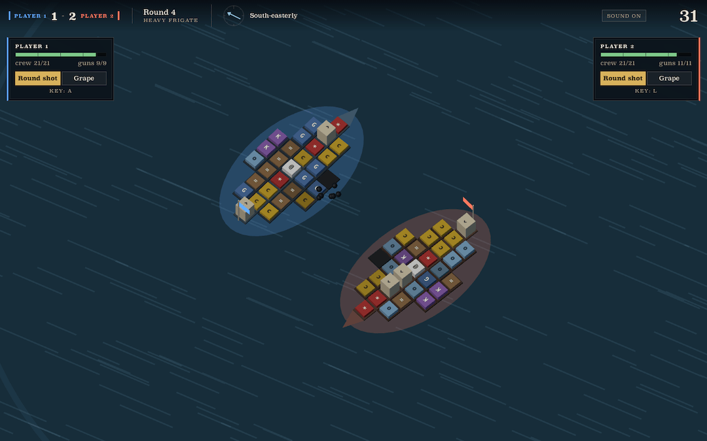

# Broadside

A game for two to four players about fitting out an age-of-sail ship and then watching it fight.
Play on one keyboard, or over a WebSocket with a four-letter join code.

You spend a timed build phase spending scrap on guns, crew, powder, masts and timber, laid out cell by cell on a hull. Then both ships sail themselves, and the only thing you touch is your ammunition: round shot to smash hull, grape to kill the crew that works their guns.

Five rounds, first to three. Your ship carries its damage into the next round, and the hull grows each time, so round one is a blank slate and the rest are triage: patch the hole in the bow, or leave it and add another gun?

With three or four ships it is a melee: everyone fires at whoever is nearest and bearing, ships that strike their colours drift out of the fight, and the last one afloat takes the round. Comeback money is paid by where you came in, not just by losing.



## Play it

```
node server/main.js 8123                the game server: files and rooms on one port
open http://127.0.0.1:8123/index.html
```

Or `./tools/dev.sh`, which does that and also starts the headless Chrome the tools drive; `./tools/dev.sh stop` when you are done.

The menu offers one keyboard, opening a room, or joining one with a code. Everything is served over http because it uses ES modules; opening the file directly will not work. A plain static server is enough for local play, but online play needs `server/main.js` — it is the WebSocket host as well as the file server.

Ammunition keys go A, L, Q, P by seat; online, only your own ship answers to you. Space locks in a build. M mutes.

## What is in here

No build step, no dependencies, no package.json, and no assets — three.js is vendored, and every sound is synthesised at runtime. It is a directory of text you can read start to finish.

```
index.html  styles.css
src/sim/      the deterministic battle core: seeded, whole 60Hz ticks, no DOM, no renderer
src/net/      the authority, the client, and the two transports it speaks through
src/render/   three.js: an instanced ship, instanced particles, an orthographic plan view
src/audio/    every sound, built from oscillators and one buffer of noise
src/ui/       the build panel, the HUD, the menu and the lobby
server/       a Node host, and RFC 6455 by hand in 340 lines
tools/        headless harnesses, and a CDP driver that plays the game in a real browser
```

The simulation is pure and seeded, so the same seed and the same inputs always replay the same battle. That is the whole of the networking: the server runs the battle that counts and relays each ammunition toggle stamped with a tick number, and every client rebuilds the same battle from those numbers. No position is ever sent, because both sides can compute it. A client that drifts is caught by a checksum twice a second and repaired by replaying from the start, which costs a few milliseconds.

Getting that to hold across browsers was not free. ECMA-262 does not specify `sin`, `cos` or `atan2` exactly, and V8 and Safari's JavaScriptCore disagree on 21% of `atan2` arguments — enough to make two thirds of sampled ship states differ within one second of a battle. Rounding every transcendental result to float32 collapses the disagreement, and `node tools/engines.js` runs the same battles under both engines and diffs them bit for bit.

The same property is what lets the whole game be measured instead of guessed at:

```
node tools/watch.js     is a battle worth watching: dead air, dead stretches, orbiting
node tools/balance.js   matchups per hull, graded, worst pairing named
node tools/parts.js     per part, across hundreds of random builds: dominant, even, or a trap
node tools/tune.js      sweep any constant and see what it costs on both counts
node tools/ablate.js    disable one mechanic at a time and count what actually changes
node tools/bench.js     simulation throughput, about 3,100 battles a second
node tools/melee.js     three and four ships: length, seat fairness, and what to build
node tools/netcheck.js  the authority against its clients, over a virtual wire with jitter
node tools/netplay.js 4 four real browsers through a whole online match
node tools/audio.js     render every sound offline: clipping, DC offset, onset clicks
node tools/mix.js       what the mixer actually hears once a battle is shouting at it
node tools/frames.js    frame times as a distribution, because stutter lives in the tail
node tools/fill.js      what each layer of the scene costs to draw, one at a time
node tools/quality.js   adaptive resolution: GPU pressure, fallback and recovery
node tools/playtest.js  plays a whole match through the real interface and complains
```

Nearly every decision in the game was settled by one of those, and several confident guesses were wrong. The ships used to fire one volley and then sail off the map together — that turned out to be a one-line steering bug, not a tuning problem. Grape shot was silently killing an entire crew in a single volley. A ship with crew for half its guns could put every hand on the wrong side and never fire a shot.

## More

- [GAME_DESIGN.md](GAME_DESIGN.md) — the design, the parts, and the reasoning behind both.
- [CLAUDE.md](CLAUDE.md) — working notes: what is load-bearing, what is flavour, and the gotchas
  already paid for.
